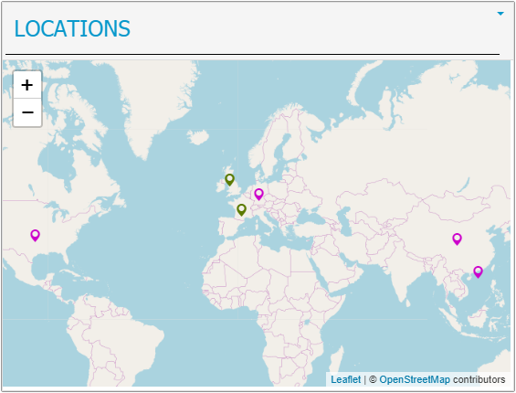
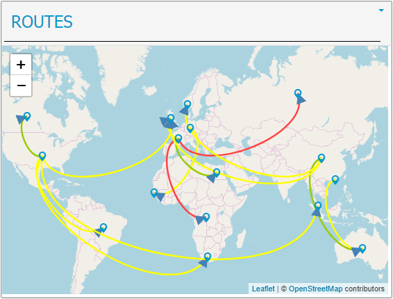
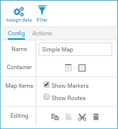
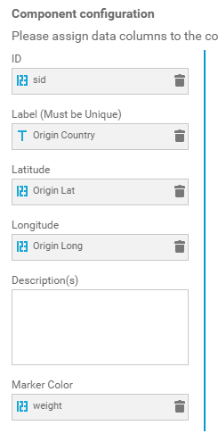
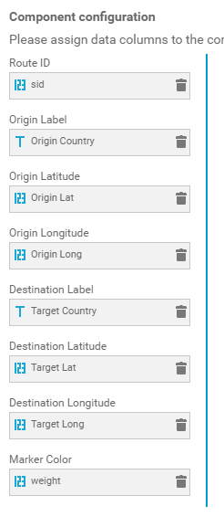
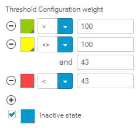

Custom Map Widget
=============================

Overview
--------
Using this widget you can display locations and/or routes in a map. The map is based on [Leaflet](http://leafletjs.com/), a JavaScript library for mobile-friendly interactive maps, and uses OpenStreetMap as the map data source (please refer to [Leaflet Documentation](http://leafletjs.com/reference-1.2.0.html) and their [FAQ](https://github.com/Leaflet/Leaflet/blob/master/FAQ.md) if you want to use a different map provider).

 

Installation
------------
Please refer to the MashZone NextGen documentation on how to install a custom widget.

Usage
-----

Once you drop the map widget in your dashboard, you can configure it to show Locations and Routes.

Depending on that, you will see different data columns to be assigned in the "Assign Data" dialog.

Locations | Routes
--------- | ------
 | 

The location label is currently used as "unique" key when showing locations and/or routes. Routes will only be shown when origin and destination are different.
If you want to show different colors on the location icons or route arrows, you can use the "Marker Color" attribute for it and configure the thresholds accordingly.

This widget has been used with MashZone NextGen v10.0 and 10.1. Consider it as an initial, very simple implementation that you can fork and extend to fit your needs.

------------------------------------------------------------------------

These tools are provided as-is and without warranty or support. They do not constitute part of the Software AG product suite. Users are free to use, fork and modify them, subject to the license agreement. While Software AG welcomes contributions, we cannot guarantee to include every contribution in the master project.

------------------------------------------------------------------------

Contact us at [TECHcommunity](mailto:technologycommunity@softwareag.com?subject=Github/SoftwareAG) if you have any questions.