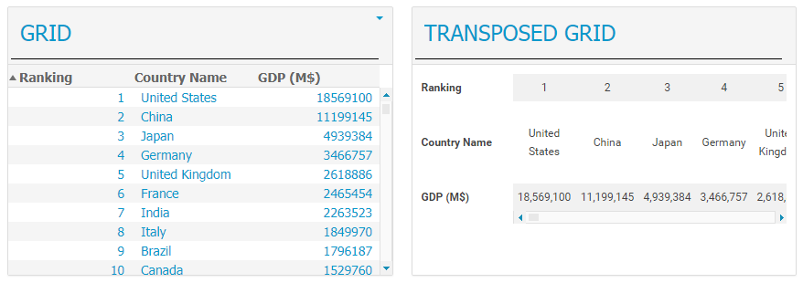

Transposed Grid Custom Widget
=============================

Overview
--------
This custom widget will show the data transposed. That is, the configured column names will be shown in the first cell of the first column, while the rest of the data will be shown in further columns.
In the image you can see a comparison on how data is displayed in an OOTB grid widget vs the transposed grid custom widget.

Installation
------------
Please refer to the MashZone NextGen documentation on how to install a custom widget.

Usage
-----
The transposed grid custom widget can be used in the same way as a standard grid widget.
The format configured for numeric data columns will be used as well to display its value.
As of today, aggregation and thresholds are not yet implemented.
This widget has been used with MashZone NextGen v10.0 and 10.1

------------------------------------------------------------------------

These tools are provided as-is and without warranty or support. They do not constitute part of the Software AG product suite. Users are free to use, fork and modify them, subject to the license agreement. While Software AG welcomes contributions, we cannot guarantee to include every contribution in the master project.

------------------------------------------------------------------------

Contact us at [TECHcommunity](mailto:technologycommunity@softwareag.com?subject=Github/SoftwareAG) if you have any questions.